# 老王打卡：安装、使用、管理与自部署完整图文教程

本教程按“普通用户使用 → 管理员设置 → 自己部署”排列。每张示意图里的红色箭头表示需要点击或填写的位置；不同 iOS、Shadowrocket 和 Cloudflare 版本的文字可能略有不同，以当前界面为准。

## 开始前先确认

- iPhone/iPad 已安装 Shadowrocket（小火箭）或其他兼容代理工具，并拥有可正常使用的代理配置。
- Safari 可以访问你的选点站点；使用公共版本时是 `https://ding.199060.xyz`。
- 证书解密只应在自己的设备、自己的代理配置和获得授权的网络中使用。
- iOS 26 及更高版本可能长期缓存位置；换点后若未变化，通常需要重启设备。
- 本工具修改 Apple WLOC 网络定位结果，并非硬件 GPS；依赖纯 GPS、蓝牙信标或风控校验的 App 可能不采用它。

---

## 第一部分：普通用户安装与使用

### 第 1 步：打开选点站点

用 Safari 打开 `https://ding.199060.xyz`。确认地址栏是 HTTPS、页面标题显示“老王打卡”，不要在来路不明的仿冒页面安装模块。


### 第 2 步：安装 Shadowrocket 模块

在首页点击“安装小火箭模块”。系统会跳转到 Shadowrocket；如果没有跳转，长按“复制模块地址”，复制 `https://ding.199060.xyz/modules/wloc.module`，再到 Shadowrocket 的模块页面手动添加。


### 第 3 步：确认导入

在 Shadowrocket 的导入提示中核对模块名称和来源域名，点击“安装”或“添加”。不要导入来源不明、内容不可查看的模块。


### 第 4 步：启用模块

进入 Shadowrocket → 配置 → 模块，找到刚导入的模块并打开右侧开关。更新站点模块后，可在这里重新下载或更新。


### 第 5 步：打开 HTTPS 解密

进入当前配置的 HTTPS 解密/MITM 设置并打开开关。模块需要读取并修改对应网络定位响应；没有开启时，即使页面保存成功也不会生效。



### 第 6 步：生成并安装证书

在证书设置中选择“生成新的 CA 证书”，再点击“安装证书”。如果已有自己生成且仍有效的证书，可以继续使用，不必反复生成。


### 第 7 步：安装描述文件

系统提示已下载描述文件后，打开 iOS“设置”→“通用”→“VPN 与设备管理”，选择刚下载的描述文件，点击右上角“安装”，按系统要求输入锁屏密码。


### 第 8 步：信任根证书

打开“设置”→“通用”→“关于本机”→“证书信任设置”，打开刚才安装证书的完全信任开关，并确认系统警告。仅信任你本人在 Shadowrocket 中生成的证书。


### 第 9 步：选择目标地点

返回选点站点，可通过地图点击、搜索框联想、常用地点按钮，或粘贴 Apple/高德/Google/百度地图链接选择位置。地图标记和经纬度显示正确后再继续。


### 第 10 步：储存到设备

确保 Shadowrocket 已连接且状态栏出现 VPN 图标，然后点击“储存到设备”。出现成功提示代表坐标已写入代理工具的持久化存储，不代表系统缓存已经刷新。


### 第 11 步：刷新系统位置缓存

iOS 15–18 通常等待系统下一次请求即可；iOS 26 及更高版本建议先保存位置，再重启设备。重启后先连接代理、确认模块和 HTTPS 解密已启用，再打开定位服务和地图。


### 第 12 步：在地图中验证

打开 Apple 地图观察蓝点。首次请求可能需要几十秒。不要只用一个第三方 App 判断，因为有的 App 使用 GPS、缓存或自己的风控结果。



### 第 13 步：恢复真实定位

优先关闭或删除模块，然后重启设备清除缓存。也可以使用页面的“清除/恢复”功能清空保存坐标；若模块参数中手工写了固定坐标，必须一并恢复默认值。



### 第 14 步：使用收藏位置

选好坐标后点击“收藏位置”，输入名称保存。收藏保存在当前浏览器的 `localStorage`，换浏览器、无痕模式或清理网站数据后不会同步，但不影响代理工具中已经生效的坐标。


### 第 15 步：查看定位历史

页面会把最近选择记录保存在当前浏览器。点击历史条目可快速回到该坐标；清理浏览器数据会删除历史。请勿在共用设备上保留敏感地点。


---

## 第二部分：管理员设置

### 第 16 步：登录管理后台

打开“你的域名 + `/admin`”，例如 `https://ding.199060.xyz/admin`，输入部署时通过 Cloudflare Secret 设置的管理员密码。连续失败时先确认 Secret 名称必须是 `ADMIN_PASSWORD`，而不是把密码写进源码。


### 第 17 步：修改站点设置

后台可以修改品牌名称、公开域名、公告、两条快捷指令链接和公共常用地点。域名只填主机名，不加路径；快捷指令必须使用 HTTPS。保存后刷新首页检查结果。


每次修改后检查：首页品牌和公告、模块链接域名、`/modules/wloc.module`、常用地点经纬度，以及退出后台后无法再修改配置。

---

## 第三部分：从 GitHub 部署到自己的 Cloudflare

### 第 18 步：Fork 或克隆代码并创建 KV

打开 `https://github.com/tony-wang1990/ding`，在线保存副本可点 Fork；本地部署可执行：

```bash
git clone https://github.com/tony-wang1990/ding.git
cd ding/worker
npm install
npx wrangler login
npx wrangler kv namespace create APP_DATA
```

复制命令返回的 namespace ID。把 `wrangler.example.jsonc` 复制为 `wrangler.jsonc`，将 `REPLACE_WITH_YOUR_KV_NAMESPACE_ID` 替换为自己的 ID。绑定名称 `APP_DATA` 不要改，否则后台无法保存设置。


### 第 19 步：设置两个 Secret

在 `worker` 目录执行：

```bash
npx wrangler secret put ADMIN_PASSWORD
npx wrangler secret put SESSION_SECRET
```

第一条输入自己的强管理员密码；第二条输入至少 32 个随机字符。终端输入 Secret 时不显示字符是正常现象。不要把真实值写进 `wrangler.jsonc`、README、截图或 GitHub Actions 日志。


### 第 20 步：测试并部署 Worker

```bash
npm test
npm run deploy
```

测试全部通过后，Wrangler 会输出 `*.workers.dev` 地址。打开它检查首页、`/admin` 和 `/modules/wloc.module`。若部署报 KV 不存在，通常是写入了别人的 namespace ID，或登录了错误的 Cloudflare 账号。



### 第 21 步：绑定自定义域名

域名必须先把 DNS 托管到当前 Cloudflare 账号。进入 Cloudflare 控制台 → Workers & Pages → 你的 Worker → Settings → Domains & Routes → Add → Custom domain，填写子域名并确认。等待证书变为 Active 后，再到 `/admin` 把“公开域名”改成新域名。


完成后逐项检查：

- `https://你的域名/` 返回 200 且证书有效；
- `/admin` 可以登录，`/modules/wloc.module` 可以下载；
- 首页模块按钮中的域名正确；
- 后台保存后 KV 中出现 `site_config`；
- GitHub 仓库里搜不到真实密码、API Token 和 `.dev.vars`。

---

## 常见问题排查

### 页面显示保存成功，但地图不变化

依次检查 VPN、模块、HTTPS 解密、证书信任和目标域名是否被代理；iOS 26+ 保存后重启。仍无效时查看 Shadowrocket 脚本日志是否出现 WLOC 请求。

### 模块安装按钮没有反应

用 iPhone Safari 打开，不要用部分 App 的内置浏览器。也可以复制 `/modules/wloc.module` 完整链接，到 Shadowrocket 模块页手动添加。

### 后台密码总是错误

Secret 名称必须精确为 `ADMIN_PASSWORD`；`SESSION_SECRET` 也必须存在，否则登录后无法保持会话。修改后重新部署或等待配置生效。

### 后台提示 APP_DATA 未绑定

检查 `wrangler.jsonc` 的 KV binding 是否为 `APP_DATA`，ID 是否属于当前账号，修改后重新部署。

### 别人是否可以使用我的部署

可以，只要站点公开、模块链接可访问且 Cloudflare 配额足够。收藏和历史存在每位用户自己的浏览器，公共站点配置存在部署者的 KV。不要共享管理员密码。

### 许可证需要注意什么

代码基于 [Yu9191/wloc](https://github.com/Yu9191/wloc)，使用 GNU AGPL-3.0。可以部署、修改、分享；对外提供修改版网络服务时，应向使用者提供对应源代码并保留许可证和原作者声明。许可证原文见 [LICENSE](../LICENSE)。

## 更新已经部署的版本

```bash
git pull
cd worker
npm install
npm test
npm run deploy
```

更新不会主动删除 KV 中的 `site_config`。如自行修改过代码，应先在独立分支合并和测试，不要直接覆盖。
